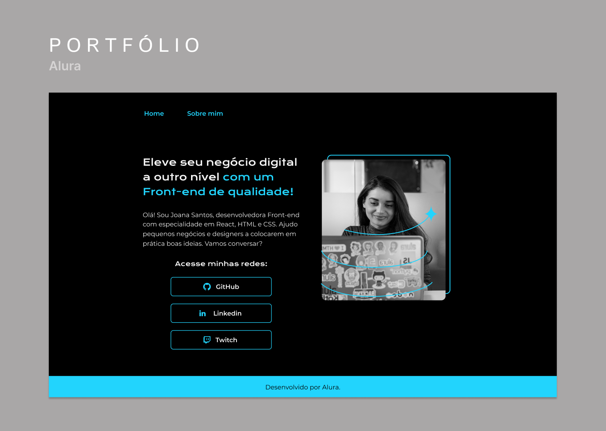

<h1 align="center"> Portfolio</h1>

Projeto de Portfólio desenvolvido em curso  

  <a href="#-tecnologias">Tecnologias</a>&nbsp;&nbsp;&nbsp;|&nbsp;&nbsp;&nbsp;
  <a href="#-projeto">Projeto</a>&nbsp;&nbsp;&nbsp;|&nbsp;&nbsp;&nbsp;
  <a href="#-layout">Layout</a>&nbsp;&nbsp;&nbsp;|&nbsp;&nbsp;&nbsp;

 

  

## 🚀 Tecnologias

Esse projeto foi desenvolvido com as seguintes tecnologias:

- HTML e CSS
- Github
- Figma

## 💻 Projeto

Modelo de portfolio desenvolvido com resposividade.

- [Visite o projeto online](https://suzannemoraes.github.io/portfolio-alura)

## 🔖 Layout

Você pode visualizar o layout do projeto através [DESSE LINK](https://figmashort.link/AFAtMQ). 
É necessário ter conta no [Figma](https://figma.com) para acessá-lo.

---
Suzanne Moraes
Linkedin: https://www.linkedin.com/in/suzannemoraes/

